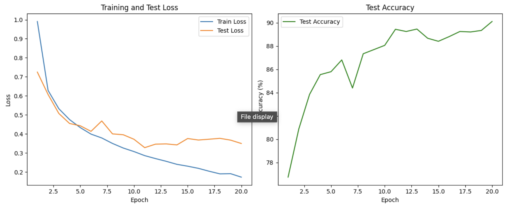

# CSCI-385-ML
Capstone Course Beloit College

# Machine Learning Projects on GTSRB, MNIST, and Housing Price Prediction

This repository contains three machine learning projects demonstrating the use of neural networks with PyTorch on different datasets:

1. **GTSRB Dataset**: Traffic sign classification using a Multilayer Perceptron (MLP).
2. **MNIST Dataset**: Handwritten digit recognition using a Multilayer Perceptron (MLP).
3. **Housing Price Dataset**: Housing price prediction using a Multilayer Perceptron (MLP).

---

## Table of Contents

- [Prerequisites](#prerequisites)
- [Installation](#installation)
- [Projects](#projects)
  - [1. GTSRB Dataset - Traffic Sign Classification](#1-gtsrb-dataset---traffic-sign-classification)
  - [2. MNIST Dataset - Handwritten Digit Recognition](#2-mnist-dataset---handwritten-digit-recognition)
  - [3. Housing Price Dataset - Housing Price Prediction](#3-housing-price-dataset---housing-price-prediction)
---

## Prerequisites

- Python 3.x
- PyTorch
- torchvision
- scikit-learn
- NumPy
- Matplotlib
- Other dependencies as specified in each project

## Installation

1. **Clone the repository:**

   ```bash
   git clone https://github.com/Princeu3/CSCI-385-ML.git
   cd CSCI-385-ML

2. **Install the required packages:**

   ```bash
   pip install -r requirements.txt


## Projects

### 1. GTSRB Dataset - Traffic Sign Classification

**Description:**

The German Traffic Sign Recognition Benchmark (GTSRB) dataset contains images of 43 different types of traffic signs. The goal is to classify images into their respective traffic sign categories using a Multi-layer Perceptron (MLP)

**Dataset:**

https://www.kaggle.com/datasets/meowmeowmeowmeowmeow/gtsrb-german-traffic-sign

**Train Loss: 0.1866, Test Loss: 0.9201, Accuracy: 84.30%**


### 2. MNIST Dataset - Hand Written Classification

**Description:**

The MNIST dataset consists of 70,000 images of handwritten digits (0-9). Each image is a 28x28 grayscale image. The task is to classify each image into the correct digit.

**Dataset:**

https://www.kaggle.com/datasets/hojjatk/mnist-dataset

**Train Loss: 0.1726, Test Loss: 0.3494, Accuracy: 90.11%**


### 3. Housing Price Dataset - Housing Price Dataset

**Description:**

The California Housing dataset contains information collected from the 1990 U.S. Census, which includes features like median income, house age, average number of rooms, etc. The goal is to predict the median house value using these features

**Dataset:**

Loading: The dataset is loaded using fetch_california_housing from scikit-learn.
Features: 8 numerical features.
Target: Median house value.

**Test MSE: 0.2645
Test R^2 Score: 0.7982**


