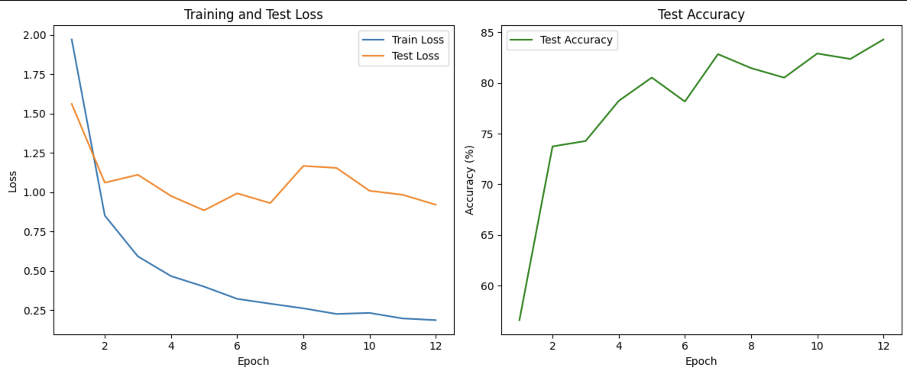

# CSCI-385-ML
Capstone Course Beloit College

# Machine Learning Projects on GTSRB, MNIST, and Housing Price Prediction

This repository contains three machine learning projects demonstrating the use of neural networks with PyTorch on different datasets:

1. **GTSRB Dataset**: Traffic sign classification using a Multilayer Perceptron (MLP).
2. **MNIST Dataset**: Handwritten digit recognition using a Multilayer Perceptron (MLP).
3. **Housing Price Dataset**: Housing price prediction using a Multilayer Perceptron (MLP).

---

## Table of Contents

- [Prerequisites](#prerequisites)
- [Installation](#installation)
- [Projects](#projects)
  - [1. GTSRB Dataset - Traffic Sign Classification](#1-gtsrb-dataset---traffic-sign-classification)
  - [2. MNIST Dataset - Handwritten Digit Recognition](#2-mnist-dataset---handwritten-digit-recognition)
  - [3. Housing Price Dataset - Housing Price Prediction](#3-housing-price-dataset---housing-price-prediction)
- [Results](#results)
- [Acknowledgments](#acknowledgments)
- [Contact](#contact)
- [Dependencies](#dependencies)
- [Tips for Running the Scripts](#tips-for-running-the-scripts)
- [Contributing](#contributing)

---

## Prerequisites

- Python 3.x
- PyTorch
- torchvision
- scikit-learn
- NumPy
- Matplotlib
- Other dependencies as specified in each project

## Installation

1. **Clone the repository:**

   ```bash
   git clone https://github.com/Princeu3/CSCI-385-ML.git
   cd CSCI-385-ML

2. **Install the required packages:**

   ```bash
   pip install -r requirements.txt


## Projects

### 1. GTSRB Dataset - Traffic Sign Classification

**Description:**

The German Traffic Sign Recognition Benchmark (GTSRB) dataset contains images of 43 different types of traffic signs. The goal is to classify images into their respective traffic sign categories using a Multi-layer Perceptron (MLP)

**Dataset:**

https://www.kaggle.com/datasets/meowmeowmeowmeowmeow/gtsrb-german-traffic-sign

**Train & Test Loss, Final Accuracy**



